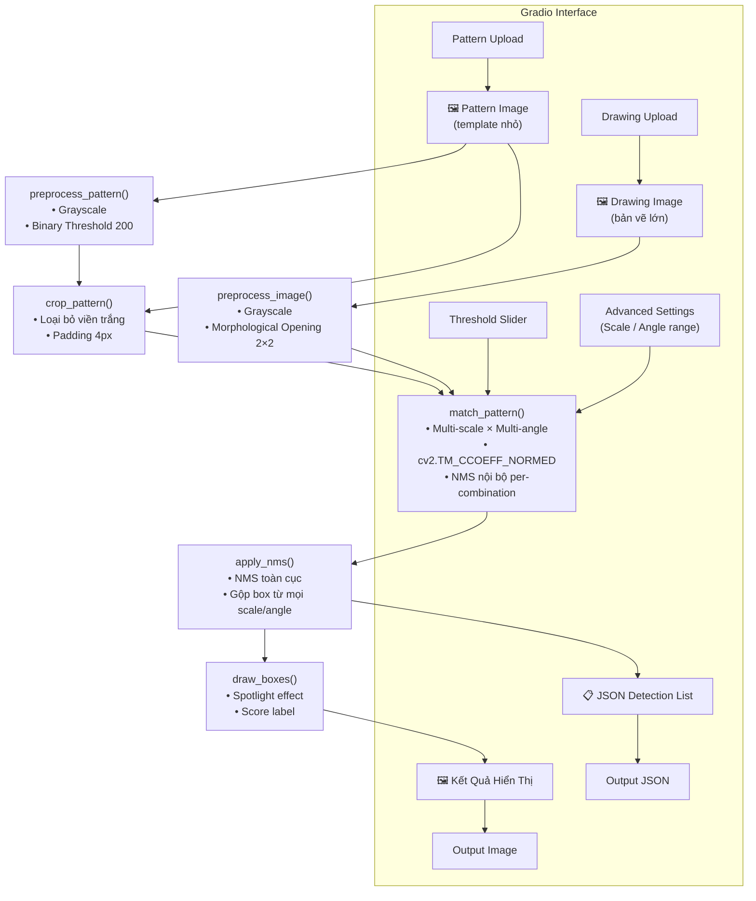
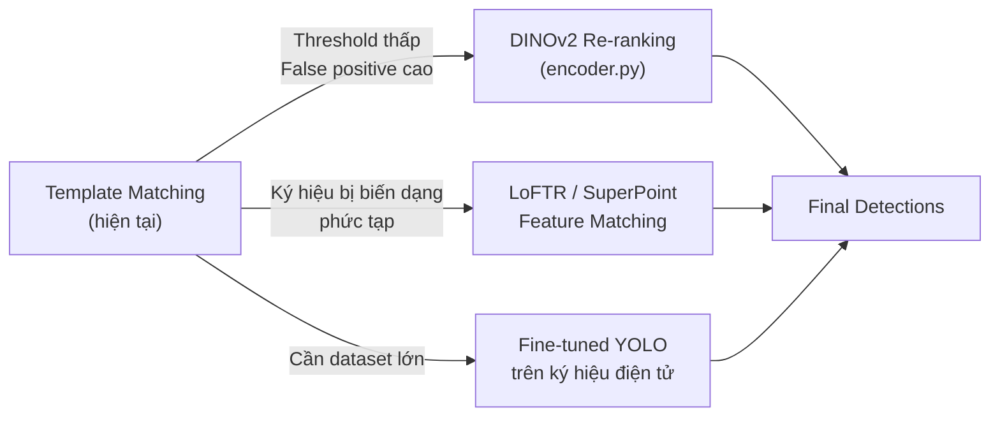

# Bản Đặc Tả Hệ Thống — AI Pattern Detection

> **Phiên bản:** 1.0 · **Ngày:** 2026-05-30 · **Tác giả:** Nhóm phát triển

---

## 1. Tổng Quan

Hệ thống **AI Pattern Detection** nhận vào một ảnh mẫu (template/symbol) nhỏ và một ảnh bản vẽ kỹ thuật lớn, sau đó tự động xác định tất cả vị trí mà mẫu xuất hiện — kể cả khi mẫu bị **xoay**, **thay đổi kích thước**, hoặc **nhiễu nhẹ**.

Ứng dụng điển hình: phát hiện ký hiệu điện tử (điện trở, tụ điện, IC…) trong bản vẽ sơ đồ mạch điện kỹ thuật.

---

## 2. Kiến Trúc Hệ Thống



---

## 3. Chi Tiết Từng Module

### 3.1 `preprocess.py` — Tiền Xử Lý Ảnh

#### 3.1.1 `preprocess_pattern(img)`

| Bước | Thao tác | Lý do |
|------|----------|-------|
| 1 | Chuyển sang **Grayscale** | Template matching chỉ cần thông tin cường độ sáng, không cần màu sắc. Giảm 3× bộ nhớ và tăng tốc |
| 2 | **Binary Threshold** (ngưỡng 200) | Chuẩn hóa ảnh mẫu: đảm bảo mọi pixel hoặc là đen (nội dung) hoặc trắng (nền). Loại bỏ artifact nén JPEG/PNG |

> [!IMPORTANT]
> **Không** áp dụng Morphological Opening cho pattern. Kernel 2×2 sẽ xóa các nét mảnh như cạnh hộp điện trở chỉ rộng 1-2 px, làm mẫu bị méo và giảm độ chính xác matching.

#### 3.1.2 `preprocess_image(img)`

| Bước | Thao tác | Lý do |
|------|----------|-------|
| 1 | Grayscale | Giống pattern — tăng tốc, đồng nhất không gian màu |
| 2 | **Morphological Opening** (kernel 2×2) | Bản vẽ lớn thường có nhiễu điểm nhỏ do scan. Opening (erosion → dilation) loại bỏ speckle mà không ảnh hưởng đường nét chính |

#### 3.1.3 `crop_pattern(img, padding=4)`

Kỹ thuật **auto-crop** loại bỏ vùng trắng thừa xung quanh ký hiệu:
1. Invert ảnh → pixel nội dung trở thành màu sáng
2. `cv2.findNonZero` + `cv2.boundingRect` tìm bounding box tối thiểu
3. Thêm padding 4px để không cắt xén nét biên

**Lý do cần crop:** Nếu pattern có viền trắng thừa lớn, kích thước template matching window sẽ bị thổi phồng không cần thiết — làm giảm precision và tăng thời gian chạy.

---

### 3.2 `matcher.py` — Lõi Phát Hiện

#### 3.2.1 Không gian tìm kiếm mặc định

```python
_DEFAULT_SCALES = [0.9, 1.0, 1.1, 1.2, 1.3, 1.4, 1.5, 1.6]   # 8 mức
_DEFAULT_ANGLES = [0, 45, 90, 135, 180, 225, 270, 315]           # 8 hướng
# Tổng: 64 tổ hợp (scale × angle)
```

#### 3.2.2 `rotate_image(image, angle)`

Chiến lược xoay hai cấp độ:

| Góc | Phương pháp | Lý do |
|-----|-------------|-------|
| 0° | No-op (return ngay) | Tiết kiệm CPU |
| 90°/180°/270° | `cv2.rotate` | Pixel-perfect, zero interpolation error |
| Góc tùy ý | `cv2.warpAffine` + canvas mở rộng | Canvas được tính lại để ảnh không bị cắt sau khi xoay |

**Công thức canvas mới:**
```
new_w = h × |sin θ| + w × |cos θ|
new_h = h × |cos θ| + w × |sin θ|
```
Background fill = **255 (trắng)** — khớp với nền bản vẽ kỹ thuật, tránh nhiễu viền đen khi matching.

#### 3.2.3 `match_pattern()` — Thuật toán chính

```
FOR mỗi scale ∈ scales:
    resized_pattern = resize(pattern, scale)
    FOR mỗi angle ∈ angles:
        rotated = rotate(resized_pattern, angle)
        result_map = cv2.matchTemplate(drawing, rotated, TM_CCOEFF_NORMED)
        candidates = positions where result_map ≥ threshold
        → NMS nội bộ (loại chồng lấp cùng scale/angle)
        → Thêm vào danh sách boxes
```

**Tại sao `TM_CCOEFF_NORMED`?**

| Metric | Đặc điểm | Phù hợp |
|--------|----------|---------|
| `TM_SQDIFF` | Nhạy với chênh lệch giá trị tuyệt đối | Không — cường độ sáng scan có thể lệch |
| `TM_CCORR_NORMED` | Nhạy với thay đổi nền | Không — nền bản vẽ không đồng nhất |
| **`TM_CCOEFF_NORMED`** | Bất biến với trung bình + variance | **Có** — chỉ phản ánh pattern tương đồng về hình dạng |

**Tại sao NMS hai lớp?**
- **NMS nội bộ** (per scale/angle): Giảm số candidate trước khi gộp, tránh `apply_nms` phải xử lý hàng nghìn box.
- **NMS toàn cục** (`postprocess.py`): Gộp box từ nhiều scale/angle khác nhau — cùng một ký hiệu có thể được phát hiện ở scale 1.0 và 1.1 đồng thời.

---

### 3.3 `postprocess.py` — Hậu Xử Lý

#### `apply_nms(boxes, score_threshold=0.50, nms_threshold=0.30)`

Sử dụng `cv2.dnn.NMSBoxes` — triển khai C++ tốc độ cao của OpenCV.

| Tham số | Giá trị mặc định | Ý nghĩa |
|---------|-----------------|---------|
| `score_threshold` | 0.50 | Loại bỏ ngay box yếu (score < 0.5) trước NMS |
| `nms_threshold` | 0.30 | IoU > 30% → giữ box score cao hơn, xóa box còn lại |

**Lý do IoU = 0.30:** Các ký hiệu điện tử thường nhỏ và gần nhau. Ngưỡng thấp (0.30) đảm bảo chỉ merge các box thực sự chồng lấp, không vô tình merge hai ký hiệu khác nhau đứng cạnh nhau.

---

### 3.4 `visualize.py` — Hiển Thị Kết Quả

**Spotlight Effect:**
```
dark   = original × 0.35
result = dark (toàn bộ ảnh)
FOR mỗi bbox:
    result[y:y+h, x:x+w] = original[y:y+h, x:x+w]  # Phục hồi vùng detection
    draw rectangle + score label
```

**Lý do chọn hiệu ứng spotlight thay vì chỉ vẽ rectangle:**
- Người dùng tức thì nhận ra vị trí phát hiện ngay cả trong bản vẽ dày đặc ký hiệu.
- Vùng nền tối (35%) không làm mất thông tin — chỉ giảm contrast để mắt tập trung vào vùng được highlight.

---

### 3.5 `inference.py` — Orchestrator

Module này là **single entry point** duy nhất, triển khai **Facade Pattern**:

```
run_inference(pattern_path, drawing_path, tm_threshold, scales, angles)
    ↓
    _load_image()       ← validate file tồn tại + đọc được
    preprocess_pattern()
    crop_pattern()
    preprocess_image()
    match_pattern()
    apply_nms()
    draw_boxes()
    → (vis_image, boxes_list)
```

**Lý do dùng Facade Pattern:**
- `gradio_app.py` và `debug_match.py` chỉ cần gọi một hàm duy nhất.
- Thay đổi bên trong pipeline (thêm bước DINOv2 re-ranking, LoFTR…) không ảnh hưởng đến caller.

---

### 3.6 `gradio_app.py` — Giao Diện Người Dùng

#### Layout

```
┌─────────────────────────────┬────────────────────────────┐
│  Left Column (inputs)       │  Right Column (outputs)    │
│  • Pattern upload           │  • Detection image         │
│  • Drawing upload           │  • JSON boxes list         │
│  • TM Threshold slider      │                            │
│  • [Advanced Settings]      │                            │
│    ├── Scale (min/max/step) │                            │
│    └── Angle (min/max/step) │                            │
│  • [Clear] [Submit]         │                            │
└─────────────────────────────┴────────────────────────────┘
```

#### Live Preview

Khi người dùng thay đổi bất kỳ field nào trong Advanced Settings, `_preview_scales()` / `_preview_angles()` được gọi **real-time** (Gradio `.change` event) và hiển thị ngay danh sách giá trị thực tế sẽ được dùng.

```python
# Ví dụ preview:
# Scale (8 mức): [0.9, 1.0, 1.1, 1.2, 1.3, 1.4, 1.5, 1.6]
# Angles (8 góc): [0, 45, 90, 135, 180, 225, 270, 315]
```

**Lý do có preview:** Người dùng không phải đợi inference mới biết tham số của mình có hợp lệ không. Tránh tình huống step > (max - min) → danh sách rỗng.

#### Submit Flow (2 phases)

```python
submit_btn.click(fn=lambda: (None, None), ...)   # Phase 1: xóa output cũ ngay lập tức
         .then(fn=infer, ...)                      # Phase 2: chạy inference
```
Phase 1 cho phản hồi tức thì (output trắng), tránh người dùng nghĩ UI bị treo.

---

## 4. Phân Tích Trade-off và Lý Do Lựa Chọn

### 4.1 Template Matching vs Deep Learning Detection

| Tiêu chí | Template Matching (hiện tại) | YOLO / Faster-RCNN |
|----------|-----------------------------|--------------------|
| **Dữ liệu huấn luyện** | Không cần | Cần hàng nghìn ảnh nhãn |
| **Zero-shot** | ✅ Chỉ cần 1 ảnh mẫu | ❌ |
| **Thời gian setup** | Phút | Tuần/tháng |
| **Tốc độ** | Nhanh (CPU đủ dùng) | Nhanh hơn với GPU |
| **Robustness noise** | Trung bình | Cao |
| **Biến thể phức tạp** | Hạn chế | Tốt hơn |

**Lý do chọn Template Matching:** Bài toán yêu cầu **zero-shot** (không có dataset huấn luyện sẵn), người dùng chỉ cung cấp 1 ký hiệu mẫu. Template Matching là lựa chọn tự nhiên và đủ chính xác cho ký hiệu kỹ thuật có hình dạng xác định.

### 4.2 DINOv2 Re-ranking (encoder.py — optional stage)

Module `encoder.py` tích hợp DINOv2 ViT-Small để **re-rank** candidate boxes. Được giữ trong codebase như một tầng tùy chọn:

- **Khi nào dùng:** TM threshold thấp (< 0.5) → nhiều false positive → cần DINOv2 lọc lại.
- **Khi nào bỏ qua:** TM threshold cao (≥ 0.65) → kết quả đã đủ chính xác mà không cần overhead DINOv2.

### 4.3 Multi-scale vs Image Pyramid

Cách tiếp cận hiện tại resize **template** thay vì tạo image pyramid cho drawing:

| Cách | Ưu | Nhược |
|------|----|-------|
| Resize template | Drawing không bị resize → giữ chất lượng | Template nhỏ → artifact interpolation |
| Image pyramid | Chính xác hơn về lý thuyết | Tốn bộ nhớ O(N × scales) |

**Lý do:** Drawing bản vẽ kỹ thuật thường có độ phân giải cao (A3 scan 300 DPI ≈ 3500×4950 px). Tạo pyramid sẽ tốn hàng chục MB RAM mỗi level. Resize template nhỏ vẫn cho kết quả tốt trong thực tế.

---

## 5. Cấu Trúc Module và Phân Tách Trách Nhiệm

```
ai-pattern-detection/
├── app/
│   ├── preprocess.py   # Tiền xử lý ảnh (SRP: chỉ xử lý ảnh đầu vào)
│   ├── matcher.py      # Thuật toán matching (SRP: chỉ tìm kiếm mẫu)
│   ├── postprocess.py  # Hậu xử lý (SRP: chỉ lọc/gộp kết quả)
│   ├── visualize.py    # Hiển thị (SRP: chỉ render output)
│   ├── inference.py    # Orchestrator – Facade Pattern
│   └── encoder.py      # DINOv2 re-ranking (optional, plug-in)
├── gradio_app.py       # UI layer (tách biệt hoàn toàn với logic)
├── debug_match.py      # Debug tool (không ảnh hưởng production)
├── requirements.txt
└── README.md
```

Nguyên tắc thiết kế:
- **Single Responsibility Principle (SRP)**: Mỗi file chỉ làm một việc.
- **Open/Closed**: Thêm bước mới (LoFTR, SAM crop…) chỉ cần thêm module mới + cập nhật `inference.py`, không sửa các module hiện có.
- **Dependency Inversion**: `gradio_app.py` phụ thuộc vào abstraction `run_inference()`, không phụ thuộc trực tiếp vào `matcher`, `postprocess`, v.v.

---

## 6. Error Handling

| Tầng | Lỗi có thể xảy ra | Xử lý |
|------|------------------|-------|
| `inference.py` | File không tồn tại | `FileNotFoundError` rõ ràng |
| `inference.py` | cv2.imread thất bại | `ValueError` với mô tả lỗi |
| `preprocess.py` | Ảnh None / rỗng | `ValueError` với tên hàm + mô tả |
| `preprocess.py` | Số kênh màu không hỗ trợ | `ValueError` với shape thực tế |
| `matcher.py` | threshold ngoài [0,1] | `ValueError` |
| `matcher.py` | Scale âm/bằng 0 | Log warning + bỏ qua |
| `matcher.py` | Pattern lớn hơn drawing | Log debug + bỏ qua |
| `postprocess.py` | Danh sách rỗng | Trả về `[]` (không crash) |
| `visualize.py` | Box ngoài biên ảnh | Log warning + clip bounds |
| `gradio_app.py` | step ≤ 0 hoặc min > max | Preview cảnh báo "danh sách trống" |

---

## 7. Logging

Hệ thống sử dụng `logging` module chuẩn Python (không dùng `print`):

```python
import logging
logger = logging.getLogger(__name__)

# DEBUG: chi tiết kỹ thuật (shape ảnh, crop bounds…)
# INFO:  kết quả quan trọng (số candidate, số detection cuối)
# WARNING: tình huống bất thường nhưng không crash
# ERROR: (nâng lên Exception) tình huống nghiêm trọng
```

Caller có thể cấu hình log level tùy môi trường:
```python
logging.basicConfig(level=logging.DEBUG)  # Development
logging.basicConfig(level=logging.INFO)   # Production
```

---

## 8. Hiệu Năng

| Tham số | Giá trị mặc định | Ghi chú |
|---------|-----------------|---------|
| Scales | 8 mức | Tăng → chi tiết hơn, chậm hơn O(n) |
| Angles | 8 hướng (bước 45°) | Giảm bước → chi tiết hơn, chậm hơn |
| Template size | ~50–200 px | Sau crop; ảnh hưởng thời gian warpAffine |
| Drawing size | ~3000×4000 px | Ảnh hưởng lớn nhất đến tốc độ |

**Tổng số lần gọi `cv2.matchTemplate`:** `len(scales) × len(angles)` = 64 lần (mặc định).  
Mỗi lần: O(W × H) → tổng O(64 × W × H). Với drawing 3000×4000 ≈ **768 triệu phép tính**.

> [!TIP]
> Để tăng tốc: giảm bước angle (e.g., step = 90° → 4 angles thay vì 8), hoặc thu nhỏ drawing trước khi matching rồi scale lại tọa độ output.

---

## 9. Hướng Mở Rộng



| Hướng | Khi nào dùng | Độ phức tạp |
|-------|-------------|-------------|
| DINOv2 re-ranking | Precision thấp | Thấp — đã có `encoder.py` |
| Batch inference | Drawing lớn, nhiều pattern | Trung bình |
| LoFTR matching | Ký hiệu bị perspective distortion | Cao |
| Fine-tuned detector | Có dataset 1000+ ảnh nhãn | Rất cao |
